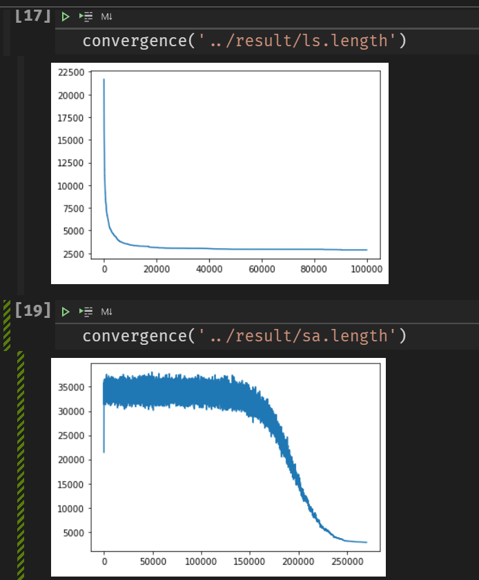

# 实验报告

| 姓名   | 学号     |
| ------ | -------- |
| 张翊健 | 18340217 |
| 郑立锋 | 18340226 |

## 目录

[toc]

## 一、模拟退火算法与遗传算法（单点与多点智能优化）

### 摘要：

我们分别使用模拟退火算法和遗传算法求解TSP问题。首先我们定义了解和解空间，随后定义了领域操作，并实现了局部搜索和模拟退火求解TSP问题。遗传算法to do。我们最终找到的解都不超过最优值的10％。可以看到模拟退火最初的波动较大，可能需要为它提供更多的迭代才能找到更好的解。而局部搜索早早就收敛了，很可能是陷入了局部最优值。

### 1．导言

#### 1.1 TSP问题

用一句话概括TSP问题：在一个哈密顿图中，求最短哈密顿路。

哈密顿路指经过每个节点一次的回路，而哈密顿图指含有哈密顿回路的图。求哈密顿回路本身也是一个 NPC 的问题，而 TSP 问题则是个 NPH 问题。

在TSPLIB（http://comopt.ifi.uni-heidelberg.de/software/TSPLIB95/，多个地址有备份；其他网站还可以找到有趣的art TSP和national TSP）中选一个大于100个城市数的TSP问题，进行求解。

实验时采用了kroC100数据集，城市数量为 100，最优解长度为2586.77，其1.1倍为2845.447.

#### 1.2 模拟退火算法

固体从高温退火到低温，最终稳定在最佳状态。这个过程中，固体内部粒子的无序性逐渐减小，物体缓慢退火，在每个温度粒子都达到平衡态，最终物理冷却，内能达到最小。

模拟退火算法就是模拟这个过程设计设计出的最优化方法。

用问题的解空间表示物体内部的状态，用解的函数值表示状态的能量，用解在邻域中的变化表示状态的转移，用控制参数表示温度，用控制参数的修改表示退火过程，最后得到最优解时能量处于最低状态。

#### 1.3 遗传算法

to do

### 2．实验过程

所用的具体的算法思想流程；
实现算法的程序主要流程，功能说明；

#### 2.1 局部搜索

首先采用多种邻域操作的局部搜索local search策略求解TSP问题。

首先要定义解和解空间。

为了使用模拟退火算法解决该问题，我们把解定义为节点序列 $p=(x_1,x_2,x_3,...,x_n)$，其中 $x_1,x_2,...,x_n\in\{1,2,...,n\}$且两两互不相等。

由于所采用的问题提供的数据集给出了所有点的坐标，所有距离可以通过勾股定理计算得到，因此该图是完全图，自然也是哈密顿图，任何遍历了所有点的节点序列都可以是一个解，即解空间为所有$\{1,2,...,n\}$的排列。

随后，我们采用了三种在邻域中获取解的方法，而且这些方法本质上都是基于交换，因此保证所得的新解依然在解空间中。

以下为我们局部搜索以及后面的模拟退火所采用的领域操作：

+ 选择 $p$ 中的任意两个节点，并交换其在 $p$ 中的位置。
+ 选择 $p$ 中的任意一段节点，并将这一段节点倒序重排，得到新解。
+ 将 $p$ 中某段的第一个节点移到该段最后的位置，得到新解。

整个算法过程中会随机的选取以上三种操作之一。

\3. 要求求得的解不要超过最优值的10％，并能够提供可视化，观察路径的变化和交叉程度。

 

遗传算法：用遗传算法求解TSP问题（问题规模等和模拟退火求解TSP实验同），要求：

1.设计较好的交叉操作，并且引入多种局部搜索操作（可替换通常遗传算法的变异操作）

2.和之前的模拟退火算法（采用相同的局部搜索操作）进行比较

3.得出设计高效遗传算法的一些经验，并比较单点搜索和多点搜索的优缺点。

#### 2.2 模拟退火

在局部搜索策略的基础上，加入模拟退火simulated annealing策略，并比较两者的效果

#### 2.3 遗传算法

to do

### 3．结果分析

#### 3.1 实验环境和参数

硬件：r5-4500u

软件：windows 10下的wsl，g++

参数：初始温度`T0`，结束温度`TN`，降温系数`ALPHA`，马尔科夫链长度`M`

#### 3.2 局部搜索

运行6次，分别得到解长度为2985.95，2957.45，2860.09，2879.29，2806.48，2854.85.

如下表：

| 最好解  | 最差解  | 平均值   | 标准差   |
| ------- | ------- | -------- | -------- |
| 2806.48 | 2957.45 | 2890.685 | 61.87826 |

其中仅有1个解符合要求（不超过最优值的10％）.

算法本身是足够快的，可惜解的精度不够。

可能需要提高搜索次数。

#### 3.3 模拟退火

运行6次，分别得到解长度为2934.28，2892.34，2860.16，2786.96，2760.65，2794.98.

如下表：

| 最好解  | 最差解  | 平均值   | 标准差  |
| ------- | ------- | -------- | ------- |
| 2760.65 | 2934.28 | 2838.228 | 62.1185 |

运行的时候需要明显的等待几秒，比局部搜索要慢。

以下分别是局部搜索算法和模拟退火算法的收敛性：

可以看到模拟退火最初的波动较大，可能需要为它提供更多的迭代才能找到更好的解。而局部搜索早早就收敛了，很可能是陷入了局部最优解。

本实验的不足之处是尚未针对不同的算法进行合理的比较，它们使用的参数数量和意义都不同，无法很好的比较。

### 4．结论

局部搜索比较容易陷入局部最优解。

模拟退火的特性比较明显，在温度较高时的扰动能力使它具有跳出局部最优解的可能。

### 主要参考文献

[1]张军,詹志辉,陈伟能,钟竞辉,陈霓,龚月姣,许瑞填,官兆.计算智能[M]. 北京:清华大学出版社, 2009. 196-201

## 二、BP神经网络和卷积神经网络CNN

摘要：简要介绍要解决的问题，所使用的方法步骤，取得的结果或结论。

### 1．导言

   要解决的问题描述，问题背景介绍；
   拟使用的方法，方法的背景介绍；

### 2．实验过程

   所用的具体的算法思想流程；
   实现算法的程序主要流程，功能说明；

### 3．结果分析

   交代实验环境，算法设计设计的参数说明；
   结果（图或表格），比如在若干次运行后所得的最好解，最差解，平均值，标准差。
   分析算法的性能，包括解的精度，算法的速度，或者与其他算法的对比分析。
   算法的优缺点；本实验的不足之处，进一步改进的设想。

### 4．结论

   简要结论或者体会。

### 主要参考文献(三五个即可)

## 三、图神经网络+强化学习（图深度强化学习解决优化问题）

摘要：简要介绍要解决的问题，所使用的方法步骤，取得的结果或结论。

### 1．导言

   要解决的问题描述，问题背景介绍；
   拟使用的方法，方法的背景介绍；

### 2．实验过程

   所用的具体的算法思想流程；
   实现算法的程序主要流程，功能说明；

### 3．结果分析

   交代实验环境，算法设计设计的参数说明；
   结果（图或表格），比如在若干次运行后所得的最好解，最差解，平均值，标准差。
   分析算法的性能，包括解的精度，算法的速度，或者与其他算法的对比分析。
   算法的优缺点；本实验的不足之处，进一步改进的设想。

### 4．结论

   简要结论或者体会。

### 主要参考文献(三五个即可)

