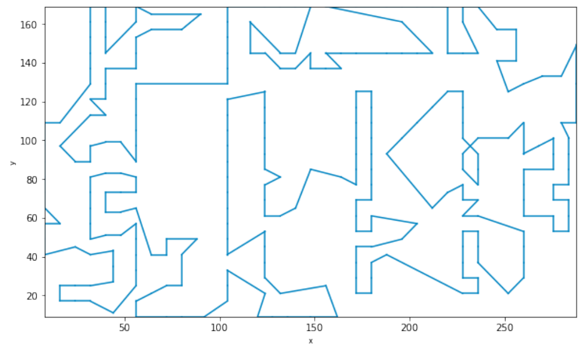
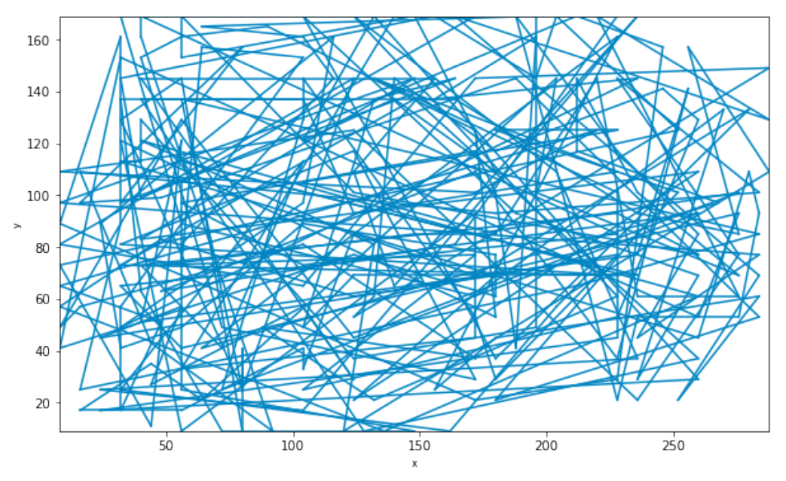

# 实验报告

| 姓名   | 学号     |
| ------ | -------- |
| 张翊健 | 18340217 |
| 郑立锋 | 18340226 |

## 目录

[toc]

<div style="page-break-after:always"></div>

## 一、模拟退火算法与遗传算法（单点与多点智能优化）

### 摘要：

我们分别使用模拟退火算法和遗传算法求解TSP问题。首先我们定义了解和解空间，随后定义了领域操作，并实现了局部搜索和模拟退火求解TSP问题。遗传算法to do。我们最终找到的解都不超过最优值的10％。可以看到模拟退火最初的波动较大，可能需要为它提供更多的迭代才能找到更好的解。而局部搜索早早就收敛了，很可能是陷入了局部最优值。


### 1．导言

#### 1.1 TSP问题

用一句话概括TSP问题：在一个哈密顿图中，求最短哈密顿路。

哈密顿路指经过每个节点一次的回路，而哈密顿图指含有哈密顿回路的图。求哈密顿回路本身也是一个 NPC 的问题，而 TSP 问题则是个 NPH 问题。

在TSPLIB（http://comopt.ifi.uni-heidelberg.de/software/TSPLIB95/，多个地址有备份；其他网站还可以找到有趣的art TSP和national TSP）中选一个大于100个城市数的TSP问题，进行求解。

实验时采用了kroC100数据集，城市数量为 100，最优解长度为2586.77，其1.1倍为2845.447.

#### 1.2 模拟退火算法

固体从高温退火到低温，最终稳定在最佳状态。这个过程中，固体内部粒子的无序性逐渐减小，物体缓慢退火，在每个温度粒子都达到平衡态，最终物理冷却，内能达到最小。

模拟退火算法就是模拟这个过程设计设计出的最优化方法。

用问题的解空间表示物体内部的状态，用解的函数值表示状态的能量，用解在邻域中的变化表示状态的转移，用控制参数表示温度，用控制参数的修改表示退火过程，最后得到最优解时能量处于最低状态。

#### 1.3 遗传算法

to do


### 2．实验过程

所用的具体的算法思想流程；
实现算法的程序主要流程，功能说明；

#### 2.1 局部搜索

首先采用多种邻域操作的局部搜索local search策略求解TSP问题。

首先要定义解和解空间。

为了使用模拟退火算法解决该问题，我们把解定义为节点序列 $p=(x_1,x_2,x_3,...,x_n)$，其中 $x_1,x_2,...,x_n\in\{1,2,...,n\}$且两两互不相等。

由于所采用的问题提供的数据集给出了所有点的坐标，所有距离可以通过勾股定理计算得到，因此该图是完全图，自然也是哈密顿图，任何遍历了所有点的节点序列都可以是一个解，即解空间为所有$\{1,2,...,n\}$的排列。

随后，我们采用了三种在邻域中获取解的方法，而且这些方法本质上都是基于交换，因此保证所得的新解依然在解空间中。

以下为我们局部搜索以及后面的模拟退火所采用的领域操作：

+ 选择 $p$ 中的任意两个节点，并交换其在 $p$ 中的位置。
+ 选择 $p$ 中的任意一段节点，并将这一段节点倒序重排，得到新解。
+ 将 $p$ 中某段的第一个节点移到该段最后的位置，得到新解。

整个算法过程中会随机的选取以上三种操作之一。


#### 2.2 模拟退火

在局部搜索策略的基础上，加入模拟退火simulated annealing策略。

算法流程图和伪代码如图所示：


该算法有明显可以复用局部搜索中的操作，因此我们重新组织了文件结构。


#### 2.3 遗传算法

to do


遗传算法：用遗传算法求解TSP问题（问题规模等和模拟退火求解TSP实验同），要求：

1.设计较好的交叉操作，并且引入多种局部搜索操作（可替换通常遗传算法的变异操作）

2.和之前的模拟退火算法（采用相同的局部搜索操作）进行比较

3.得出设计高效遗传算法的一些经验，并比较单点搜索和多点搜索的优缺点。


### 3．结果分析

#### 3.1 实验环境和参数

硬件：r5-4500u

软件：windows 10下的wsl，g++

参数：初始温度`T0`，结束温度`TN`，降温系数`ALPHA`，马尔科夫链长度`M`

#### 3.2 局部搜索

局部搜索较快地达到了收敛：





详见Q1 SA_and_genetic/src/showPath.pdf

运行6次，分别得到解长度为2985.95，2957.45，2860.09，2879.29，2806.48，2854.85.

如下表：

| 最好解  | 最差解  | 平均值   | 标准差   |
| ------- | ------- | -------- | -------- |
| 2806.48 | 2957.45 | 2890.685 | 61.87826 |

其中仅有1个解符合要求（不超过最优值的10％）.

算法本身是足够快的，可惜解的精度不够。

可能需要提高搜索次数。


#### 3.3 模拟退火

模拟退火的变化较慢：





运行6次，分别得到解长度为2934.28，2892.34，2860.16，2786.96，2760.65，2794.98.

如下表：

| 最好解  | 最差解  | 平均值   | 标准差  |
| ------- | ------- | -------- | ------- |
| 2760.65 | 2934.28 | 2838.228 | 62.1185 |

运行的时候需要明显的等待几秒，比局部搜索要慢。


以下分别是局部搜索算法和模拟退火算法的收敛性：


可以看到模拟退火最初的波动较大，可能需要为它提供更多的迭代才能找到更好的解。而局部搜索早早就收敛了，很可能是陷入了局部最优解。


本实验的不足之处是尚未针对不同的算法进行合理的比较，它们使用的参数数量和意义都不同，无法很好的比较。


### 4．结论

局部搜索比较容易陷入局部最优解。

模拟退火的特性比较明显，在温度较高时的扰动能力使它具有跳出局部最优解的可能。


### 主要参考文献

[1]张军,詹志辉,陈伟能,钟竞辉,陈霓,龚月姣,许瑞填,官兆.计算智能[M]. 北京:清华大学出版社, 2009. 196-201


## 二、BP神经网络和卷积神经网络CNN

### 摘要

我们利用神经网络识别手写0-9数字，分别实现了BP神经网络和卷积神经网络。多次训练后正确率仅能达到95%，但卷积神经网络正确率更高。

### 1．导言

本实验分别使用BP神经网络和卷积神经网络实现识别手写字体。实验采用MINST手写字符集作为识别对象。其中60000张作为训练集，剩余10000张作为测试集。

BP神经网络是一种按照误差逆向传播算法训练的多层前馈神经网络。而其逆向传播过程使用了小批量梯度下降法（MBGD）。本次实验中使用的是含隐藏层的784\*30\*10的网络模型。

卷积神经网络（Convolutional Neural Networks, CNN）是一类包含卷积计算且具有深度结构的前馈神经网络（Feedforward Neural Networks），是深度学习（deep learning）的代表算法之一 。

### 2．实验过程

#### 2.1 BP神经网络的算法思想流程

首先对于每个节点，采用sigmoid函数作为激励函数：

$$ f(x)=\frac{1}{1+e^{-x}}$$

求梯度时，其导数如下：

$$ f'(x)=f(x)(1-f(x))$$

假设BP神经网络模型如下：


记误差$E=\frac{1}{2}e^2=\frac{1}{2}(y_0-y)^2$其中$y_0$为真值

则E对$w_{jk}$的偏导为：

$\frac{\partial E}{\partial w_{jk}}=\frac{\partial E}{\partial e}\times\frac{\partial e}{\partial O_{k}}\times\frac{\partial O_k}{\partial w_{jk}}=-(y_{0k}-O_{k})O_{k}(1-O_{k})O_{j}$

而对于输出层的第k个神经元，误差梯度：

$E_k=O_k(1-O_k)(y_{0k}-O_k)$

故权重和偏移量可按以下公式更新：

$w_{jk}=w_{jk}+\eta E_kO_j$

$\theta_k=\theta_k+\eta E_k$

由以上公式可反向传播误差，结合梯度下降法，即可更新网络中的权值与偏移量。
#### 2.2 算法程序主要流程

main函数：

```python
train_images = decode_idx3_ubyte(train_images_idx3_ubyte_file)
train_labels = decode_idx1_ubyte(train_labels_idx1_ubyte_file)
test_images = decode_idx3_ubyte(test_images_idx3_ubyte_file)
test_labels = decode_idx1_ubyte(test_labels_idx1_ubyte_file)
trainingimages = [(im / 255).reshape(1, 784) for im in train_images] 
traininglabels = [vectorized_result(int(i)) for i in train_labels]
testimages = [(im / 255).reshape(1, 784) for im in test_images]
testlabels = [l for l in test_labels]

net = NueraLNet([784, 30, 10])
net.train_net(trainingimages, traininglabels, 20, 3, 10, testimages, testlabels)
print("end")
```

先读取数据然后调用net对象初始化，每个参数代表各层节点个数，第一层输入层共784个节点，第二层隐含层共30个节点，最后一层输出层共10个节点。

再对神经网络进行训练，中间的三个参数分别是：训练次数、学习率、btach大小。


train_net函数：

```python
def train_net(self, trainimage, trainresult, traintime=20, rate=5, minibatch=10, test_image=None, test_result=None):
        for i in range(traintime):
            minibatchimage = [trainimage[k:k+minibatch] for k in range(0, len(trainimage), minibatch)]
            minibatchresult = [trainresult[k:k+minibatch] for k in range(0, len(trainimage), minibatch)]
            for image, result in zip(minibatchimage, minibatchresult):
                self.update_net(image, result, rate)
            print("第{0}次学习：".format(i+1))
            if test_image and test_result:
                self.test_net(test_image, test_result)
```

对于每一次训练，先按照batch进行分组，对每一组，调用update_net函数更新网络权值，然后用学习出来的神经网络测试准确率。


update_net函数：

```python
def update_net(self, training_image, training_result, rate):
        batch_b_error = [np.zeros(b.shape) for b in self.bias]
        batch_w_error = [np.zeros(w.shape) for w in self.weights]
        for image, result in zip(training_image, training_result):
            b_error, w_error = self.get_error(image, result)
            batch_b_error = [bbe + be for bbe, be in zip(batch_b_error, b_error)]
            batch_w_error = [bwe + we for bwe, we in zip(batch_w_error, w_error)]
        self.bias = [b - (rate/len(training_image))*bbe for b, bbe in zip(self.bias, batch_b_error)]
        self.weights = [w - (rate/len(training_image))*bwe for w, bwe in zip(self.weights, batch_w_error)]
```

对传进来的一批batch中所有样本误差梯度的平均值更新一次神经网络的参数。首先按照类中存储权重和偏移量的变量格式相应声明存取权重和偏移量误差梯度的变量，然后通过get_error函数得到测试这个样本之后权重和偏移量的误差梯度，再将这一批次中所有样本的误差梯度累加到先前声明的存取误差梯度的类中，最后我们根据这一批次所有样本的误差梯度平均值，乘上学习率来调整神经网络的权重和偏移量。


get_error函数：

```python
def get_error(self, image, result):
        b_error = [np.zeros(b.shape) for b in self.bias]
        w_error = [np.zeros(w.shape) for w in self.weights]
        out_data = [image]
        in_data = []
        for b, w in zip(self.bias, self.weights):
            in_data.append(np.dot(out_data[-1], w) + b)
            out_data.append(sigmoid(in_data[-1]))
        b_error[-1] = sigmoid_prime(in_data[-1]) * (out_data[-1] - result)
        w_error[-1] = np.dot(out_data[-2].transpose(), b_error[-1])
        for l in range(2, self.num_layers):
            b_error[-l] = sigmoid_prime(in_data[-l]) * \
                          np.dot(b_error[-l+1], self.weights[-l+1].transpose())
            w_error[-l] = np.dot(out_data[-l-1].transpose(), b_error[-l])
        return b_error, w_error
```

get_error函数也就是的反向传播误差的过程。首先声明存取权重和偏移量误差梯度的变量，然后在for循环中完成前向传播，完成后即可开始计算误差梯度：先计算输出层的偏移量和权重误差梯度，然后逐层往前反向误差传播，计算每一层的偏移量和权重误差梯度。


### 3．结果分析

实验环境：python3、pytorch

#### BP神经网络准确率：


#### CNN准确率：


### 4．结论

   不管是正确率还是训练速度，CNN都比BP神经网络效果好。


### 主要参考文献

使用Python解析MNIST数据集：https://www.jianshu.com/p/84f72791806f


## 三、图神经网络+强化学习（图深度强化学习解决优化问题）

to do

摘要：简要介绍要解决的问题，所使用的方法步骤，取得的结果或结论。


### 1．导言

   要解决的问题描述，问题背景介绍；
   拟使用的方法，方法的背景介绍；

### 2．实验过程

   所用的具体的算法思想流程；
   实现算法的程序主要流程，功能说明；

### 3．结果分析

   交代实验环境，算法设计设计的参数说明；
   结果（图或表格），比如在若干次运行后所得的最好解，最差解，平均值，标准差。
   分析算法的性能，包括解的精度，算法的速度，或者与其他算法的对比分析。
   算法的优缺点；本实验的不足之处，进一步改进的设想。

### 4．结论

   简要结论或者体会。


### 主要参考文献(三五个即可)


